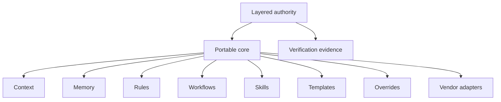

# Architecture Overview

## Purpose

This document summarizes the architecture of Pakemin.

## Design

Pakemin connects project-owned knowledge, scoped authority, and deterministic verification without making vendor-specific entry points canonical.

The portable core is the canonical source for project context, decisions, rules, workflows, and reusable instructions. Vendor adapters are thin files or generated configurations that help specific AI agents consume the portable core. The primary default entry point is `AGENTS.md`.

## Responsibilities

The portable core is responsible for vendor-agnostic project knowledge.

Vendor adapters are responsible for compatibility with specific tools.

Project overrides are responsible for refining shared defaults within a repository.

Architecture decision records are responsible for recording significant decisions and their consequences.

## Boundaries

Pakemin includes a minimal local CLI, adapter generator, and documentation validation. It does not define a strict schema, hosted service, agent runtime, plugin system, or model-specific orchestration platform.

## Precedence

The project-owned authority hierarchy is defined by [ADR-0009: Layered Authority and Provenance](../adr/0009-layered-authority.md): Defaults, optional Organization, Repository, Scope, and Task. Child authority can only remain equally restrictive or become more restrictive, and every effective rule retains provenance. Safety and platform restrictions remain higher than project authority. [ADR-0014](../adr/0014-least-change-verification.md) proposes how effective authority is compared with actual changes.

## Open Questions

- Does a portable-core manifest need separately versioned semantics?
- When accepted, what is the smallest useful verification implementation slice?
