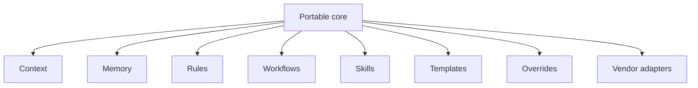

# Architecture Overview

## Purpose

This document summarizes the architecture of AES at the documentation-foundation stage.

## Design

AES separates project-owned knowledge from vendor-specific agent entry points.

The portable core is the canonical source for project context, decisions, rules, workflows, and reusable instructions. Vendor adapters are thin files or generated configurations that help specific AI agents consume the portable core.

## Responsibilities

The portable core is responsible for vendor-neutral project knowledge.

Vendor adapters are responsible for compatibility with specific tools.

Project overrides are responsible for refining shared defaults within a repository.

Architecture decision records are responsible for recording significant decisions and their consequences.

## Boundaries

AES is not currently defining a schema, CLI, package format, installation method, adapter generator, or validation engine.

## Preliminary Precedence

The following order is provisional and must be finalized through an ADR before becoming normative:

1. Explicit current user instruction.
2. Safety and platform restrictions.
3. Project-specific overrides.
4. Project decisions and context.
5. Shared framework defaults.
6. Vendor adapter defaults.

## Open Questions

- How are conflicts between shared rules and project overrides resolved?
- Should adapters copy content or only reference it?
- How should agents that cannot recursively load linked files be supported?
- Should `AGENTS.md` be the universal fallback adapter?

