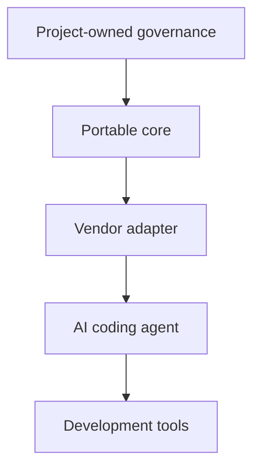

# Overview

## Purpose

Pakemin is an open-source AI Engineering Governance Framework for helping software projects work with coding agents without duplicating project knowledge across vendor-specific instruction files.

The central principle is that project knowledge belongs to the project, not to the AI vendor.

## Background

Different AI coding agents expect different files and conventions. A team may maintain `AGENTS.md`, `CLAUDE.md`, `GEMINI.md`, Cursor rules, GitHub Copilot instructions, and other configuration files for the same repository.

When each file contains full instructions, the project gradually accumulates conflicting copies of the same context. Pakemin proposes a portable core as the canonical source of truth, with thin vendor adapters that refer to or translate that core.

## Current Status

Current stable: `v0.2.0`.

The stable release includes a dependency-free CLI, v1-oriented `.ai` scaffolding, thin adapter generation, validation, language presets, governance verification through `pakemin check`, and a reference repository. Task-aware verification remains deferred until a task-envelope contract exists.

Pakemin does not include schemas, plugin architecture, hosted services, automated extraction, or agent orchestration.

## Basic Model

## Open Questions

- What is the smallest valid Pakemin-compatible project?
- Which files are normative and which are recommendations?
