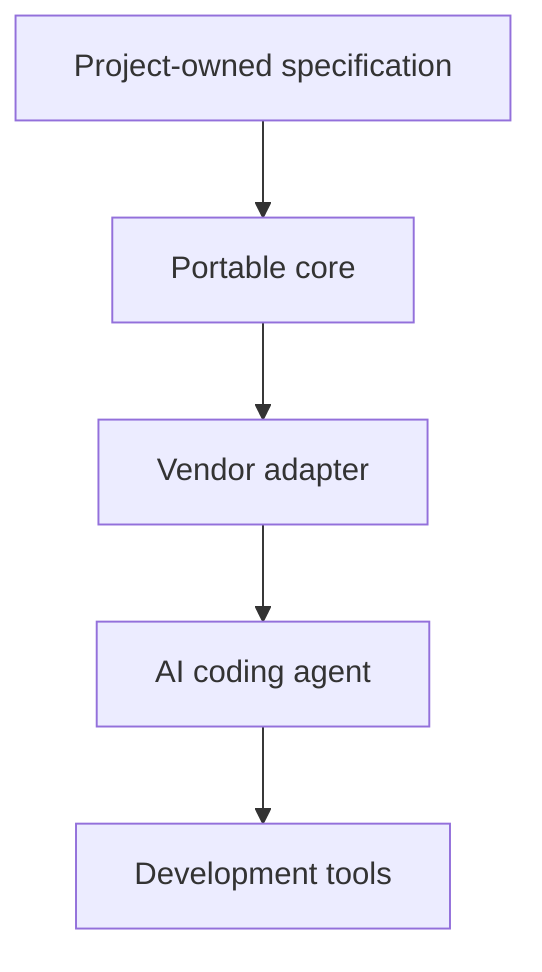

# Overview

## Purpose

AES exists to help software projects work with multiple AI coding agents without duplicating project knowledge across vendor-specific instruction files.

The central principle is that project knowledge belongs to the project, not to the AI vendor.

## Background

Different AI coding agents expect different files and conventions. A team may maintain `AGENTS.md`, `CLAUDE.md`, `GEMINI.md`, Cursor rules, GitHub Copilot instructions, and other configuration files for the same repository.

When each file contains full instructions, the project gradually accumulates conflicting copies of the same context. AES proposes a portable core as the canonical source of truth, with thin vendor adapters that refer to or translate that core.

## Current Milestone

The current milestone is documentation only. It establishes the vocabulary, repository structure, architectural categories, and first decision record.

The milestone does not include a CLI, schemas, adapter generation, plugins, automated extraction, or package setup.

## Basic Model

## Open Questions

- Is AES primarily a specification, a CLI, or both?
- What is the smallest valid AES-compatible project?
- Which files are normative and which are recommendations?

